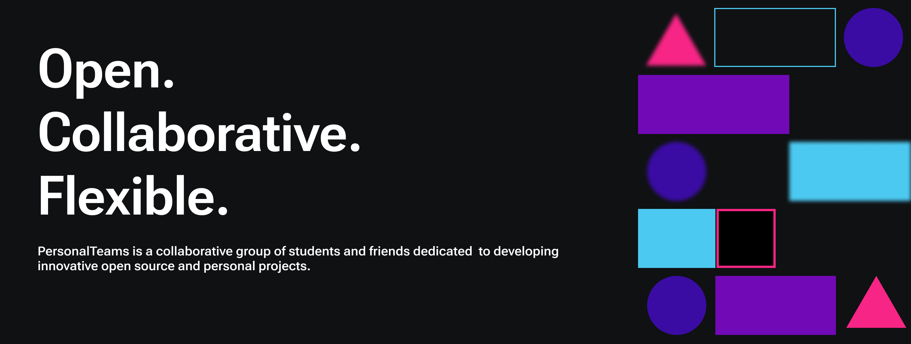

Welcome to Omnivault! We are a collaborative group of students and friends dedicated to developing innovative open source and personal projects. Our mission is to create impactful software solutions while learning and growing together as a community.

<!-- ## Get Involved

Right now, our open communities are building amazing software together, and there are excellent "good first issue" opportunities if you're looking to get involved.

* [Explore featured projects](https://github.com/PersonalTeams/featured-projects)
* [Explore open source contributions](https://github.com/PersonalTeams/open-source-jobs)
* [Apply for project support](https://github.com/PersonalTeams/project-support) -->

<!-- Visit [our website](https://personalteams.com) to learn more! -->

----

<!-- Omnivault projects adopt the [PersonalTeams Open Source Code of Conduct](https://personalteams.com/codeofconduct). For more information, see the [Code of Conduct FAQ](https://personalteams.com/codeofconduct/faq/). -->

## Contact Us

If you have any questions or want to get in touch, please feel free to contact us at Email. [udomkiatphokaew@gmail.com](udomkiatphokaew@gmail.com).
